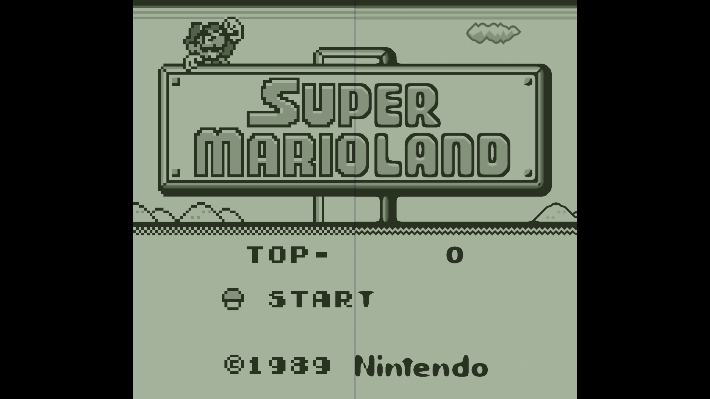
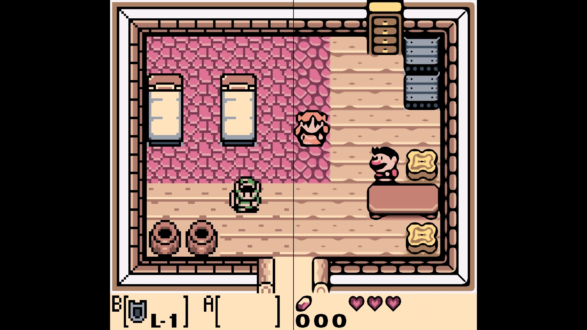
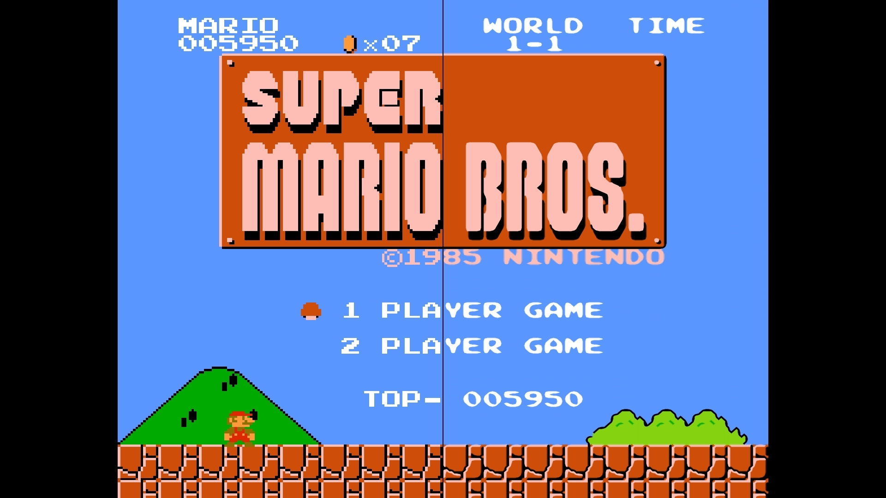
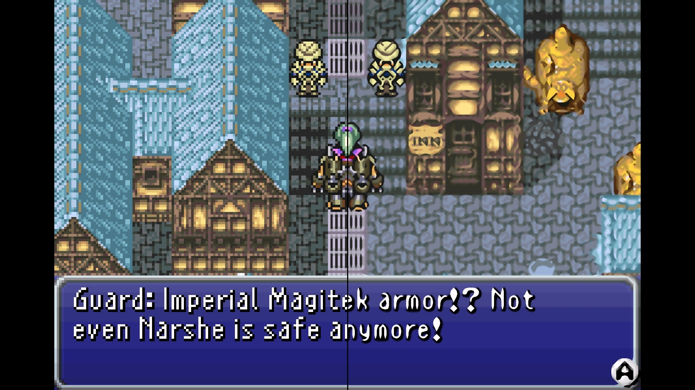
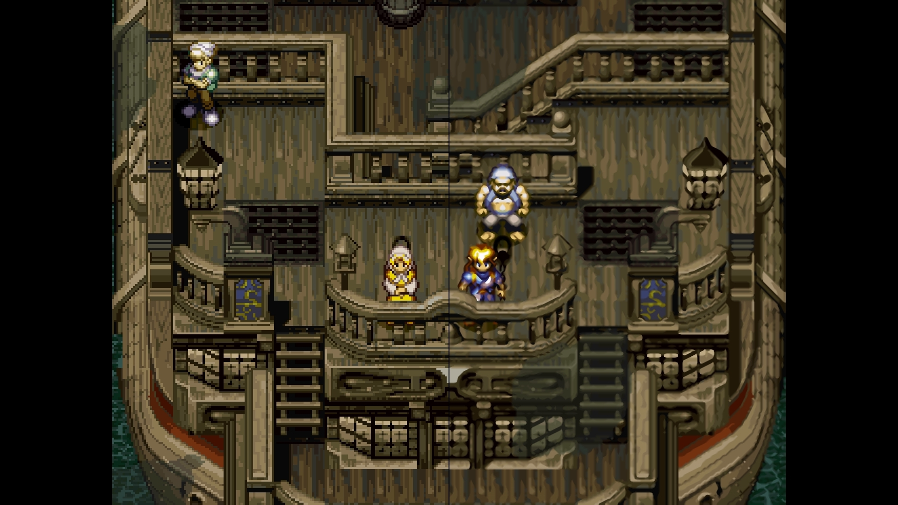
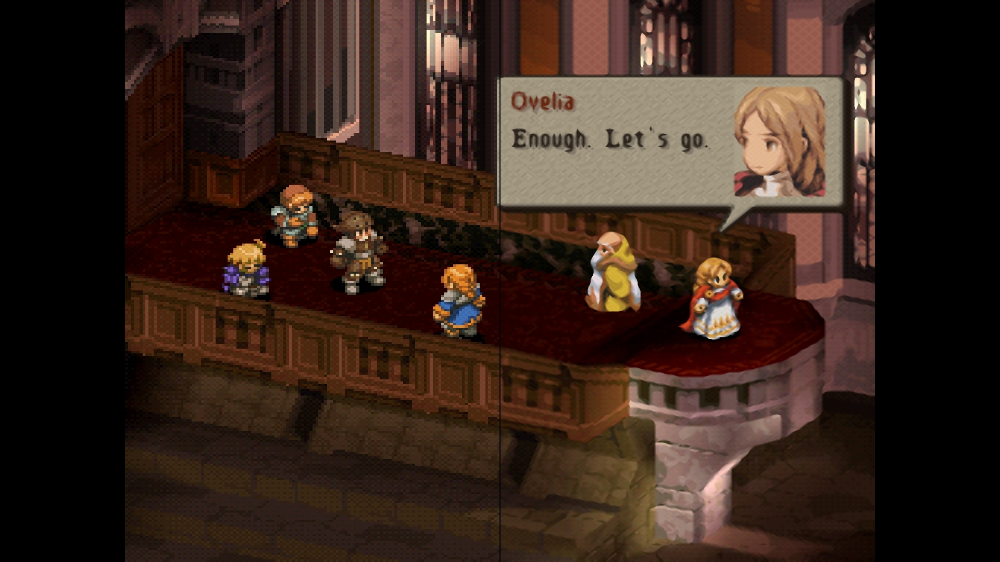
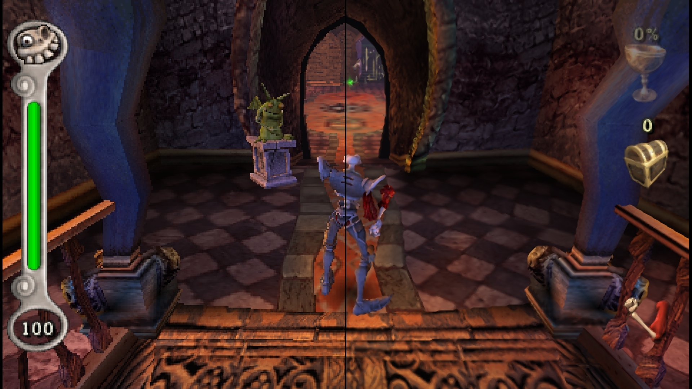

# Cheap Upscaling Triangulation

Cheap Upscaling Triangulation (CUT) is a family of single-image upscaling algorithms for retro games designed to be:

* **Versatile**: they can upscale from and to any image resolution and are applicable to all the 2D and 3D consoles that [Lemuroid](https://github.com/Swordfish90/Lemuroid) supports
* **Efficient**: battery consumption is very critical on mobile devices, so they leverage the GPU and keep the number of samples and calculations as low as possible

In order to achieve this, we need to **CUT some corners**... Literally!

## Algorithms

The family currently consists of two algorithms **CUT** and **CUT2**, which share the same basic steps:

* Edge Detection
* Triangulation / Pattern Recognition
* Interpolation

These steps are implemented differently in the two algorithms, leading to different quality and performance levels:

* **[CUT2](/algorithms/cut2.md)**: Uses a 4x4 pixel window and can approximate edges of  30°, 45° and 60°
* **[CUT](/algorithms/cut.md)**: Uses a 2x2 pixel window and can approximate edges of 45°

## Results

Here you can find some results. On the left you can see the input image, while on the right the image processed with CUT2.

||||
|---|---|---|
 |  | 
 |  | 
 |  | 

## Performances

There aren't yet extensive performance tests, but I tried measuring GPU load on my device, a Galaxy S21 FE with Snapdragon 888 playing Final Fantasy VI Advance.

|Filter|GPU Utilization|Resolution
|---|---|---|
Bilinear (Lemuroid) | ~1.5% | 1080p
HQx2 (Retroarch) | ~2.5% | 320p
**CUT (Lemuroid)** | **~3.5%** | **1080p**
HQx4 (Retroarch) | ~4.5% | 640p
**CUT2 (Lemuroid)** | **~6.5%** | **1080p**
xbrz-freescale-multipass (Retroarch) | ~15.0% | 1080p
