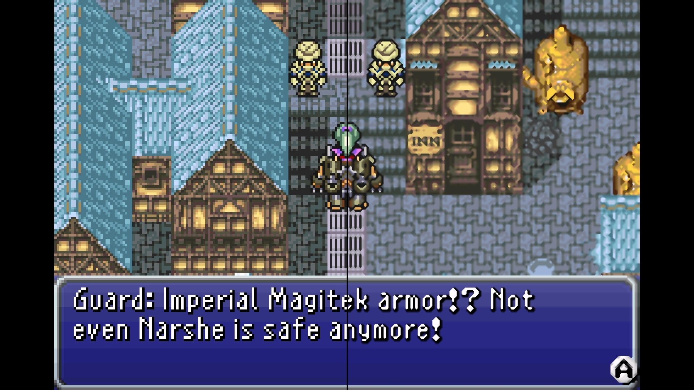
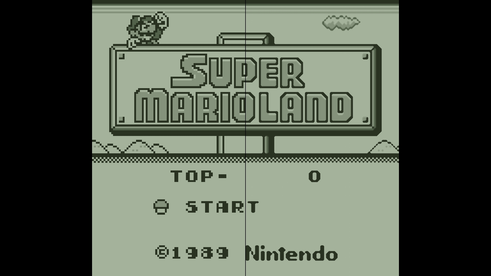
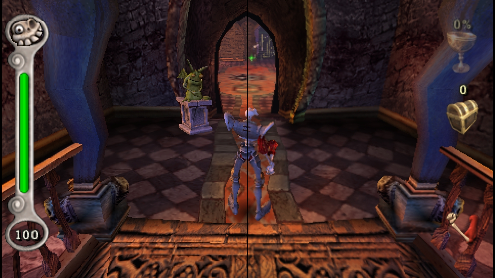

# CUT

We sample a 2x2 window. To make it more efficient, we're only going to look at the luma plane.

```
P05 -- P06
 |      |
P09 -- P10
```

## Luma extraction

For each pixel, we extract the luma value with the following:

```glsl
lowp float luma(lowp vec3 v) {
#if EDGE_USE_FAST_LUMA
  lowp float result = v.g;
#else
  lowp float result = dot(v, vec3(0.299, 0.587, 0.114));
#endif
#if LUMA_ADJUST_GAMMA
  result = sqrt(result);
#endif
  return result;
}
```

By using ```EDGE_USE_FAST_LUMA```, we can make this step faster by simply relying on the green channel as an approximation.
We can also use ```LUMA_ADJUST_GAMMA``` if we want a more accurate representation of what the human perception is.

## Edge detection

Using this window, we are able to detected only edges of 45°:

```
A -- B
|    |
C -- D
```

We detect an edge when the luma difference on one diagonal is much smaller compared to the other.

```glsl
bool hasEdge(lowp float a, lowp float b, lowp float c, lowp float d) {
  return max(distance(a, d) * EDGE_MIN_CONTRAST, EDGE_MIN_VALUE) < distance(b, c);
}
```

## Triangulation / Pattern Recognition

Let's now focus on the center square:

```
P05 -- P06
|       |
P09 -- P10
```

Considering the edges that we found in the previous step and ignoring symmetries, we're basically guaranteed to fall into one of these patterns: 

|||
|---|---|
 | 

The other split scenario can be transformed by flipping the image on the ```x = 0.5``` axis.

For each pattern, we defined a set of rules that will choose a shape and two segments on which we'll perform the interpolation:

```glsl
struct Pixels {
  lowp vec3 p0;
  lowp vec3 p1;
  lowp vec3 p2;
  lowp vec3 p3;
};

struct Pattern {
  Pixels pixels;
  bool triangle;
  lowp vec2 coords;
};
```

Here the segments are ```P0-P1``` and ```P2-P3```.

## Interpolation

Let's now assume we have ```blend(A, B, t)``` function that mixes two colors given an interpolation parameter.

We can simply use the output of the previous step to perform a bilinear interpolation on the two segments we found earlier:

```glsl
lowp vec3 weights = pattern.triangle ? triangle(pattern.coords) : quad(pattern.coords);

lowp vec3 final = blend(
  blend(pattern.pixels.p0, pattern.pixels.p1, weights.x),
  blend(pattern.pixels.p2, pattern.pixels.p3, weights.y),
  weights.z
);
```

The goal is to have smooth gradients and sharp edges, so we can define the ```blend(A, B, t)``` function as something that looks like a step when the contrast is high, and a linear interpolation when it's low.

```glsl
lowp float linearStep(lowp float edge0, lowp float edge1, lowp float t) {
  return clamp((t - edge0) / (edge1 - edge0 + EPSILON), 0.0, 1.0);
}

lowp float sharpSmooth(lowp float t, lowp float sharpness) {
  return linearStep(sharpness, 1.0 - sharpness, t);
}

lowp float sharpness(lowp float l1, lowp float l2) {
  lowp float lumaDiff = abs(l1 - l2);
  lowp float contrast = linearStep(BLEND_MIN_CONTRAST_EDGE, BLEND_MAX_CONTRAST_EDGE, lumaDiff);
  lowp float result = mix(BLEND_MIN_SHARPNESS * 0.5, BLEND_MAX_SHARPNESS * 0.5, contrast);
  return result;
}

lowp vec3 blend(lowp vec3 a, lowp vec3 b, lowp float t) {
  return mix(a, b, sharpSmooth(t, sharpness(luma(a), luma(b))));
}
```

## Results

Here we can find some results. On the left we can see the input image, while on the right the image processed with **CUT**.

||||
|---|---|---|
 |  | 
