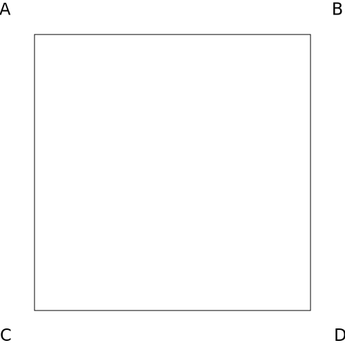
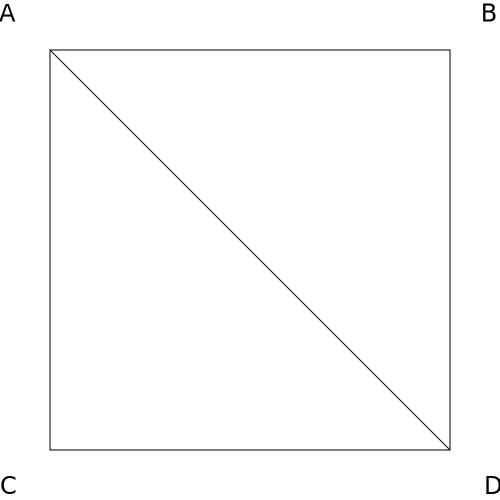
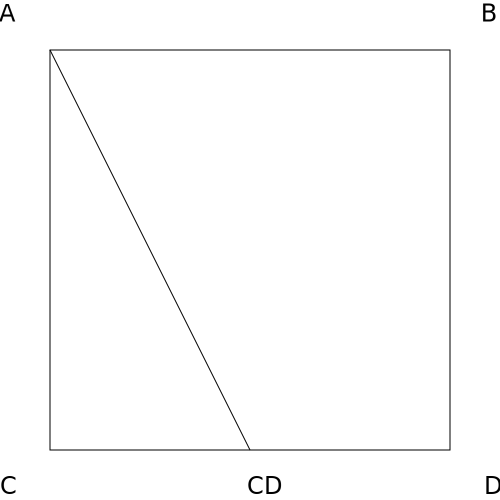
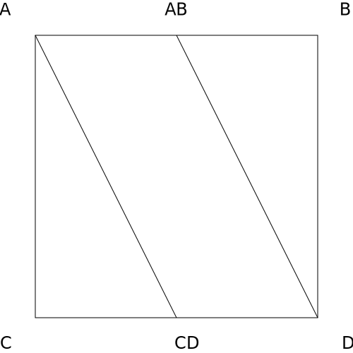
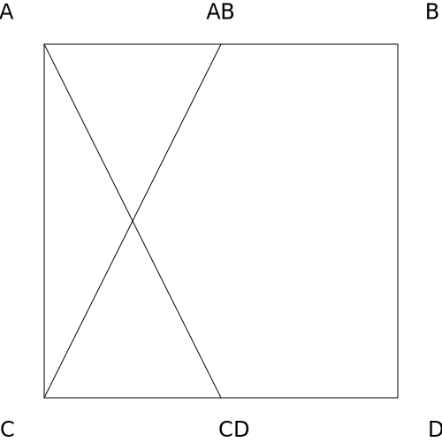
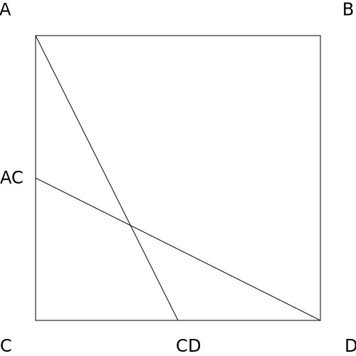

# CUT2

In CUT2, we sample a 4x4 window without the corners and we extract their luma value.

```
       P01 -- P02
        |      |
P04 -- P05 -- P06 -- P07
 |      |      |      |
P08 -- P09 -- P10 -- P11
        |      |
       P13 -- P14
```

## Edge detection

We are able to detected edges of 30°, 45° and 60°.

Standard edge detection algorithms work, but since we're dealing with images that have no noise, relying on relative contrast delivers better results.

We detect an edge when the minimum luma difference across the edge is greater than the maximum luma difference not crossing said edge.

### Edges with slope of two (30°/60°)

We need to look at every 2x3 and 3x2 block of pixels. Let's take a concrete example:

```
P01 -- P02
 |      |
P05 -- P06
 |      |
P09 -- P10
```

This block can have two edges ```[P01, P10]``` and ```[P02, P09]``` that divide the rectangle into two triangles.
For both configurations, we need to compute the differences in luma of pixels crossing and not crossing the edge, and keep track of the fact that the extremes belong to the left or right triangle.

### Edges with slope of one (45°)

We start by looking at the center square:

```
P05 -- P06
 |      |
P09 -- P10
```

Using a similar reasoning, we can detect an edge when ```P05``` and ```P10``` are similar to each other, but much different from either ```P06``` or ```P09```.

Detecting both edges leads to a valid saddle scenario. In this case, we look at the other squares in our window and align with the most prevalent diagonal.

## Triangulation / Pattern Recognition

Let's keep focusing on the center square.

If we ignore symmetries and consider the edges we detected in the previous step, we're basically guaranteed to fall into one of these patterns:

||||
|---|---|---|
 |  | 
 |  | 

Every other scenario can be handled by keeping track of symmetries along three axis:
* ```x = 0.5```
* ```y = 0.5```
* ```y = x```

## Interpolation

We are now left with a set of triangles and quads that we need to interpolate.

Using the center square pixels and the current coordinates, we apply the symmetry transformations found in the previous step.

For each pattern, we defined a set of rules that will output two line segments with associated colors from the center square at the extremities.

We can now assume we have a blend function ```blend(A, B, t)``` that mixes the colors, given a parameter representing the relative distance between the two points.

For every point of our figure, we are now able to find the projection on those segments and compute the color using the ```blend``` function.

If ```blend``` is defined as the simple interpolation formula, we'll inevitably blur the colors. We want edge to be sharp and gradients to be smooth. To achieve that, we can use a function that behaves as a step if the difference in luma is high and fall back to linear interpolation when it's low.
